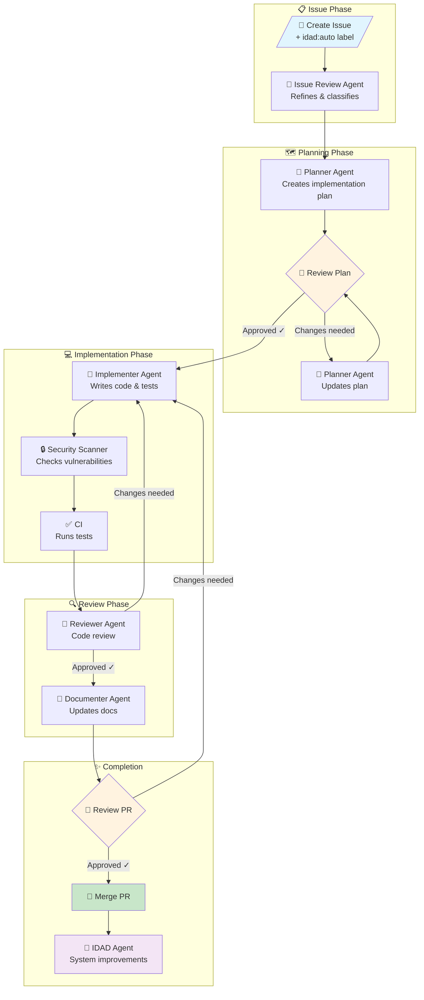

# IDAD - Issue Driven Agentic Development

🤖 **Fully automated, self-improving GitHub-based agentic coding system**

Create issues, get PRs automatically. AI agents handle the entire development workflow.

**Supports both [Cursor Agent](https://docs.cursor.com/agent/cli) and [Claude Code](https://claude.ai/code) CLIs**

---

## How It Works

```
You create an issue with idad:auto label
         ↓
🤖 Issue Review Agent → refines and classifies
         ↓
🤖 Planner Agent → creates implementation plan
         ↓
👤 You review the plan → approve or request changes
         ↓
🤖 Implementer Agent → writes code and tests
         ↓
🔒 Security Scanner → checks for vulnerabilities
         ↓
✅ CI → runs tests
         ↓
🤖 Reviewer Agent → performs code review
         ↓
🤖 Documenter Agent → updates documentation
         ↓
👤 You review and merge the PR
         ↓
🤖 IDAD Agent → analyzes for system improvements
```

---

## Install

Add IDAD to any existing repository with one command:

```bash
curl -fsSL https://raw.githubusercontent.com/kidrecursive/idad-cursor/main/install.sh | bash
```

The installer will:
- Ask which AI CLI you want to use (Cursor or Claude Code)
- Download IDAD agent definitions and workflows
- Guide you through GitHub App and API key setup
- Configure repository labels and permissions
- Commit the files to your repo

### CLI Options

| CLI | Command | API Key |
|-----|---------|---------|
| **Cursor Agent** | `cursor-agent` | `CURSOR_API_KEY` |
| **Claude Code** | `claude` | `ANTHROPIC_API_KEY` |

You can also specify the CLI directly:

```bash
# Install with Cursor (default)
curl -fsSL https://...install.sh | bash -s -- --cli cursor

# Install with Claude Code
curl -fsSL https://...install.sh | bash -s -- --cli claude
```

### Verify Installation

After installation, run the repository testing agent to verify everything is configured correctly:

**Cursor:**
```bash
cursor-agent \
  -f .cursor/rules/system.mdc \
  -f .cursor/agents/repository-testing.md \
  -p "Run the IDAD repository tests"
```

**Claude Code:**
```bash
claude \
  --system-prompt "$(cat .claude/rules/system.md)" \
  -p "Run the IDAD repository tests. $(cat .claude/agents/repository-testing.md)"
```

This verifies:
- ✅ All agent files are present
- ✅ Workflow is correctly configured
- ✅ GitHub labels exist
- ✅ Secrets are configured
- ✅ Actions permissions are set

### Try It

```bash
# Create your first automated issue
gh issue create --title "Add hello world feature" --label "idad:auto" --body "Create a simple hello world function with tests."

# Watch the agents work
gh run list --workflow=idad.yml --limit 5
```

---

## GitHub App Setup (Required)

IDAD requires a **GitHub App** to enable workflows to trigger other workflows and perform automated actions.

### Step 1: Create the GitHub App

1. Go to: [GitHub App Settings](https://github.com/settings/apps/new) (or your org's settings)
2. Configure:
   - **Name**: `IDAD Automation` (or your preferred name)
   - **Homepage URL**: Your repository URL
   - **Webhook**: Uncheck "Active" (not needed)
3. **Repository Permissions**:
   | Permission | Access |
   |------------|--------|
   | Contents | Read and Write |
   | Issues | Read and Write |
   | Pull requests | Read and Write |
   | Actions | Read and Write |
   | Workflows | Read and Write |
4. **Where can this app be installed?**: Only on this account
5. Click **"Create GitHub App"**

### Step 2: Generate Private Key

1. On the app's settings page, scroll to **"Private keys"**
2. Click **"Generate a private key"**
3. Save the downloaded `.pem` file securely

### Step 3: Install the App

1. Go to your app's settings page
2. Click **"Install App"** in the sidebar
3. Choose **"Only select repositories"**
4. Select your target repository
5. Click **"Install"**

### Step 4: Add Secrets

```bash
# Get your App ID from the app's settings page (shown at top)
gh secret set IDAD_APP_ID

# Add the private key from your .pem file
gh secret set IDAD_APP_PRIVATE_KEY < path/to/private-key.pem

# Add your AI CLI API key (one of these, depending on your choice)
gh secret set CURSOR_API_KEY      # For Cursor Agent
gh secret set ANTHROPIC_API_KEY   # For Claude Code
```

> **Note**: The private key is multi-line. Use file redirection as shown above, or paste carefully when prompted.

---

## Agents

| Agent | Purpose | Model (default) |
|-------|---------|-----------------|
| **Issue Review** | Refine and classify issues | sonnet |
| **Planner** | Create implementation plans | opus |
| **Implementer** | Write code and tests | sonnet |
| **Security Scanner** | Check for vulnerabilities | sonnet |
| **Reviewer** | Perform code review | sonnet |
| **Documenter** | Update documentation | sonnet |
| **IDAD** | Self-improvement | opus |

### Configure Models

```bash
# For Cursor Agent (uses Cursor model names)
gh variable set IDAD_MODEL_PLANNER --body "opus-4.5"
gh variable set IDAD_MODEL_IMPLEMENTER --body "sonnet-4.5"

# For Claude Code (uses Anthropic model names)
gh variable set IDAD_MODEL_PLANNER --body "claude-opus-4-20250514"
gh variable set IDAD_MODEL_IMPLEMENTER --body "claude-sonnet-4-20250514"
```

---

## Labels

Add `idad:auto` to any issue to enable automation.

| Label | Purpose |
|-------|---------|
| `idad:auto` | **Enable automation** (required) |
| `type:issue` | Standard feature |
| `type:bug` | Bug fix |
| `type:epic` | Large feature (creates sub-issues) |
| `state:plan-review` | **Waiting for plan approval** |
| `needs-clarification` | Waiting for human input |
| `needs-changes` | Code changes requested |

---

## Manual Triggers

```bash
# Trigger specific agent
gh workflow run idad.yml -f agent="planner" -f issue="123"

# Re-run implementer on existing PR
gh workflow run idad.yml -f agent="implementer" -f issue="123" -f pr="456"

# Trigger security scan
gh workflow run idad.yml -f agent="security-scanner" -f pr="456"
```

---

## File Structure (After Installation)

### Cursor Agent Installation

```
.cursor/
├── agents/
│   ├── issue-review.md
│   ├── planner.md
│   ├── implementer.md
│   ├── security-scanner.md
│   ├── reviewer.md
│   ├── documenter.md
│   ├── idad.md
│   ├── reporting.md
│   └── repository-testing.md   # Post-install verification
├── rules/
│   └── system.mdc
└── README.md

.github/workflows/
├── idad.yml
└── ci.yml
```

### Claude Code Installation

```
.claude/
├── agents/
│   ├── issue-review.md
│   ├── planner.md
│   ├── implementer.md
│   ├── security-scanner.md
│   ├── reviewer.md
│   ├── documenter.md
│   ├── idad.md
│   ├── reporting.md
│   └── repository-testing.md   # Post-install verification
└── rules/
    └── system.md

.github/workflows/
├── idad.yml
└── ci.yml
```

---

## Documentation

- [Quick Start](docs/QUICKSTART.md)
- [Installation](docs/INSTALLATION.md)
- [Workflow Guide](docs/WORKFLOW.md)
- [Agent Reference](docs/AGENTS.md)
- [Troubleshooting](docs/TROUBLESHOOTING.md)

---

## Security

- **GitHub App**: Scoped to specific repositories only
- **Private Key**: Stored securely as repository secret
- **Installation Tokens**: Auto-generated, short-lived (1 hour)
- **Security Scanner**: Checks for vulnerabilities before review
- **Opt-in Only**: Automation requires explicit `idad:auto` label
- **Bot Identity**: All actions clearly attributed to `IDAD[bot]`

---

## Workflow Diagram



---

## License

MIT

---

**Created with ❤️ by AI agents, for human developers**
