# IDAD - Issue Driven Agentic Development

🤖 **Fully automated, self-improving GitHub-based agentic coding system**

Create issues, get PRs automatically. AI agents handle the entire development workflow.

**Supports both [Claude Code](https://claude.ai/code) and [Cursor Agent](https://docs.cursor.com/agent/cli) CLIs**

---

## How It Works

```
You create an issue with idad:issue-review label
         ↓
🤖 Issue Review Agent → analyzes and validates
         ↓
🤖 Planner Agent → creates implementation plan
         ↓
👤 You review the plan → approve or request changes
         ↓
🤖 Implementer Agent → writes code and tests
         ↓
🔒 Security Scanner → checks for vulnerabilities
         ↓
🤖 Reviewer Agent → performs code review
         ↓
🤖 Documenter Agent → updates documentation
         ↓
👤 You review and merge the PR
         ↓
🤖 IDAD Agent → analyzes for system improvements
```

**Only ONE `idad:*` label per issue/PR at a time** - the label encapsulates the workflow state.

---

## Install

Add IDAD to any existing repository with one command:

```bash
curl -fsSL https://raw.githubusercontent.com/kidrecursive/IDAD/main/install.sh | bash
```

The installer will:
- Ask which AI CLI you want to use (Claude Code or Cursor)
- Download IDAD agent definitions, rules, and workflow
- Install slash commands for local CLI usage
- Guide you through GitHub App and API key setup
- Configure repository labels and permissions

**Note**: CI workflow is NOT installed by default. The IDAD agent will automatically create an appropriate CI workflow based on your project's languages and testing frameworks after the first PR merges.

### CLI Options

| CLI | Command | Authentication |
|-----|---------|----------------|
| **Claude Code** | `claude` | `ANTHROPIC_API_KEY` or `ANTHROPIC_AUTH_TOKEN` |
| **Cursor Agent** | `cursor-agent` | `CURSOR_API_KEY` |
| **OpenAI Codex** | `codex` | `OPENAI_API_KEY` |

You can also specify the CLI directly:

```bash
# Install with Claude Code (default)
curl -fsSL https://...install.sh | bash -s -- --cli claude

# Install with Cursor
curl -fsSL https://...install.sh | bash -s -- --cli cursor

# Install with Codex
curl -fsSL https://...install.sh | bash -s -- --cli codex
```

### Verify Installation

After installation, run the repository testing agent to verify everything is configured correctly:

```bash
# Use the slash command in your CLI
/idad-run-agent repository-testing
```

This verifies:
- ✅ All agent files are present
- ✅ Workflow is correctly configured
- ✅ GitHub labels exist
- ✅ Secrets are configured
- ✅ Actions permissions are set

### Try It

```bash
# Create your first automated issue
gh issue create --title "Add hello world feature" --label "idad:issue-review" --body "Create a simple hello world function with tests."

# Watch the agents work
gh run list --workflow=idad.yml --limit 5
```

### Local Usage with Slash Commands

IDAD includes slash commands for local CLI usage:

| Command | Purpose |
|---------|---------|
| `/idad-create-issue` | Create a new issue with guided questions |
| `/idad-monitor` | Monitor workflow status for issues/PRs |
| `/idad-approve-plan` | Review and approve implementation plans |
| `/idad-run-agent` | Run an agent locally for testing |

Example:
```bash
# In your CLI, type:
/idad-create-issue add user authentication

# Or reference the README for context:
@.idad/README.md Let's create an issue for adding dark mode
```

---

## GitHub App Setup (Required)

IDAD requires a **GitHub App** to enable workflows to trigger other workflows and perform automated actions.

### Step 1: Create the GitHub App

1. Go to: [GitHub App Settings](https://github.com/settings/apps/new) (or your org's settings)
2. Configure:
   - **Name**: `IDAD Automation` (or your preferred name)
   - **Homepage URL**: Your repository URL
   - **Webhook**: Uncheck "Active" (not needed)
3. **Repository Permissions**:
   | Permission | Access |
   |------------|--------|
   | Contents | Read and Write |
   | Issues | Read and Write |
   | Pull requests | Read and Write |
   | Actions | Read and Write |
   | Workflows | Read and Write |
4. **Where can this app be installed?**: Only on this account
5. Click **"Create GitHub App"**

### Step 2: Generate Private Key

1. On the app's settings page, scroll to **"Private keys"**
2. Click **"Generate a private key"**
3. Save the downloaded `.pem` file securely

### Step 3: Install the App

1. Go to your app's settings page
2. Click **"Install App"** in the sidebar
3. Choose **"Only select repositories"**
4. Select your target repository
5. Click **"Install"**

### Step 4: Add Secrets

```bash
# Get your App ID from the app's settings page (shown at top)
gh secret set IDAD_APP_ID

# Add the private key from your .pem file
gh secret set IDAD_APP_PRIVATE_KEY < path/to/private-key.pem

# Add your AI CLI authentication (choose based on your CLI)
gh secret set ANTHROPIC_API_KEY     # For Claude Code (API key)
gh secret set ANTHROPIC_AUTH_TOKEN  # For Claude Code (OAuth token - alternative)
gh secret set CURSOR_API_KEY        # For Cursor Agent
gh secret set OPENAI_API_KEY        # For OpenAI Codex
```

> **Note**: The private key is multi-line. Use file redirection as shown above, or paste carefully when prompted.

> **Claude Code Authentication**: You can use either `ANTHROPIC_API_KEY` (standard API key) or `ANTHROPIC_AUTH_TOKEN` (OAuth bearer token from `claude auth status`). Only one is required.

---

## Agents

| Agent | Purpose | Default Tier |
|-------|---------|--------------|
| **Planner** | Create implementation plans | **Opus** |
| **IDAD** | Self-improvement | **Opus** |
| **Issue Review** | Refine and classify issues | Sonnet |
| **Implementer** | Write code and tests | Sonnet |
| **Security Scanner** | Check for vulnerabilities | Sonnet |
| **Reviewer** | Perform code review | Sonnet |
| **Documenter** | Update documentation | Sonnet |

### Model Defaults

The installer configures three model tiers (large/medium/small) based on your CLI:

| Tier | Claude Code | Cursor | Codex |
|------|-------------|--------|-------|
| **Large** | `claude-opus-4-5-20251101` | `claude-opus-4-5-20251101` | `o3` |
| **Medium** | `claude-sonnet-4-20250514` | `claude-sonnet-4-20250514` | `gpt-4o` |
| **Small** | `claude-haiku-3-5-20241022` | `claude-haiku-3-5-20241022` | `gpt-4o-mini` |

**Default assignments:**
- Planner & IDAD agents → Large (complex reasoning)
- All other agents → Medium (balanced)
- Small tier available for cost-sensitive overrides

View current configuration:
```bash
gh variable list
```

### Override Models

Override any agent's model after installation:

```bash
# Override specific agent
gh variable set IDAD_MODEL_PLANNER --body "your-model-name"

# Override default for all agents
gh variable set IDAD_MODEL_DEFAULT --body "your-model-name"

# Use small model for faster/cheaper agents
gh variable set IDAD_MODEL_DOCUMENTER --body "claude-haiku-3-5-20241022"
```

Available variables: `IDAD_MODEL_DEFAULT`, `IDAD_MODEL_SMALL`, `IDAD_MODEL_PLANNER`, `IDAD_MODEL_IMPLEMENTER`, `IDAD_MODEL_REVIEWER`, `IDAD_MODEL_SECURITY`, `IDAD_MODEL_DOCUMENTER`, `IDAD_MODEL_ISSUE_REVIEW`, `IDAD_MODEL_IDAD`

---

## Labels

Add `idad:issue-review` to any issue to enable automation. **Only ONE `idad:*` label at a time.**

| Label | Purpose |
|-------|---------|
| `idad:issue-review` | **Start automation** (opt-in) |
| `idad:issue-needs-clarification` | Issue needs human input |
| `idad:planning` | Planner creating plan |
| `idad:human-plan-review` | **Waiting for plan approval** |
| `idad:implementing` | Implementer writing code |
| `idad:security-scan` | Security Scanner analyzing |
| `idad:code-review` | Reviewer analyzing |
| `idad:documenting` | Documenter updating docs |
| `idad:human-pr-review` | **Final human review** |

---

## Manual Triggers

```bash
# Trigger specific agent
gh workflow run idad.yml -f agent="planner" -f issue="123" -f pr=""

# Re-run implementer on existing PR
gh workflow run idad.yml -f agent="implementer" -f issue="123" -f pr="456"

# Trigger security scan
gh workflow run idad.yml -f agent="security-scanner" -f issue="" -f pr="456"
```

---

## File Structure (After Installation)

```
.idad/                          # CLI-agnostic IDAD configuration
├── agents/
│   ├── issue-review.md
│   ├── planner.md
│   ├── implementer.md
│   ├── security-scanner.md
│   ├── reviewer.md
│   ├── documenter.md
│   ├── idad.md
│   ├── reporting.md
│   └── repository-testing.md
├── rules/
│   └── system.md
├── commands/                   # Slash command source files
│   ├── idad-create-issue.md
│   ├── idad-monitor.md
│   ├── idad-approve-plan.md
│   └── idad-run-agent.md
└── README.md                   # Local usage documentation

.claude/commands/               # Claude Code slash commands (copies)
└── idad-*.md

.cursor/commands/               # Cursor slash commands (copies)
└── idad-*.md

.github/
├── actions/
│   └── run-idad-agent/        # Composite action for CLI abstraction
│       └── action.yml
└── workflows/
    └── idad.yml               # Unified workflow
```

The installer creates CLI-specific command directories for slash command support (except Codex, which doesn't support slash commands). All IDAD configuration lives in `.idad/`.

---

## Documentation

- [Quick Start](docs/QUICKSTART.md)
- [Installation](docs/INSTALLATION.md)
- [Workflow Guide](docs/WORKFLOW.md)
- [Agent Reference](docs/AGENTS.md)
- [Troubleshooting](docs/TROUBLESHOOTING.md)

---

## Security

- **GitHub App**: Scoped to specific repositories only
- **Private Key**: Stored securely as repository secret
- **Installation Tokens**: Auto-generated, short-lived (1 hour)
- **Security Scanner**: Checks for vulnerabilities before review
- **Opt-in Only**: Automation requires explicit `idad:issue-review` label
- **Bot Identity**: All actions clearly attributed to `IDAD[bot]`

---

## Workflow Diagram

```mermaid
flowchart TD
    subgraph Issue["📋 Issue Phase"]
        A[/"👤 Create Issue<br/>+ idad:issue-review"/]
        B["🤖 Issue Review Agent<br/>Analyzes & validates"]
    end

    subgraph Planning["🗺️ Planning Phase"]
        C["🤖 Planner Agent<br/>Creates implementation plan"]
        D{"👤 Review Plan<br/>idad:human-plan-review"}
        E["🤖 Planner Agent<br/>Updates plan"]
    end

    subgraph Implementation["💻 Implementation Phase"]
        F["🤖 Implementer Agent<br/>Writes code & tests"]
        G["🔒 Security Scanner<br/>idad:security-scan"]
    end

    subgraph Review["🔍 Review Phase"]
        I["🤖 Reviewer Agent<br/>idad:code-review"]
        J["🤖 Documenter Agent<br/>idad:documenting"]
    end

    subgraph Completion["✨ Completion"]
        K{"👤 Review PR<br/>idad:human-pr-review"}
        L["🎉 Merge PR"]
        M["🤖 IDAD Agent<br/>Creates improvement issue"]
    end

    A --> B
    B -->|"idad:planning"| C
    C --> D
    D -->|"Changes needed"| E
    E --> D
    D -->|"Approved → idad:implementing"| F
    F --> G
    G -->|"Pass"| I
    G -->|"Block"| F
    I -->|"Changes needed"| F
    I -->|"Approved"| J
    J --> K
    K -->|"Comments"| F
    K -->|"Approved"| L
    L --> M

    style A fill:#e1f5fe
    style D fill:#fff3e0
    style K fill:#fff3e0
    style L fill:#c8e6c9
    style M fill:#f3e5f5
```



---

## License

MIT

---

**Created with ❤️ by AI agents, for human developers**
